*这是tangram相机的概念概述. 提供完整的相机配置和参数技术参考, 请看 [cameras](../Syntax-Reference/cameras.md).*

为了控制被映射数据的视图，Tangram使用了类似于其他3D应用程序和库中的相机，只是做了一些调整以适应web地图的约定。

大多数2D web地图使用“zoom level”来控制其视图区域，它设置地图的可查看区域，并决定要加载哪个地图块。然而，在大多数3D环境中(包括现实生活)，你通过相机看到的东西取决于它的位置、焦距和视场，并且没有一个严格的模拟变焦水平。

为了在3D环境中支持变焦级别，我们的透视相机允许位置、视场和变焦级别相互依赖——每个参数都可以以3D相机通常不允许的方式影响其他参数。

除此之外，任何熟悉3D的人都应该能认出我们的相机。(你目前还不能旋转或倾斜相机。)

## Camera types

七巧板有三种类型的相机：`perspective`，`isometric`，和`flat`。在大多数方面，它们都类似于典型的3D相机，但有一些限制和增强，使其更适合显示地图。例如，由于七巧板JS是Leaflet插件，因此目前您无法倾斜或旋转相机。另外，它们的位置是用[lat，long，zoom]而不是3D坐标设置的。

### perspective camera
**perspective**透视相机是最像的3D相机，但也有一些独特的参数，包括`focal_length`和`vanishing_point`。

```yaml
cameras:
    camera1:
        type: perspective
```

[ 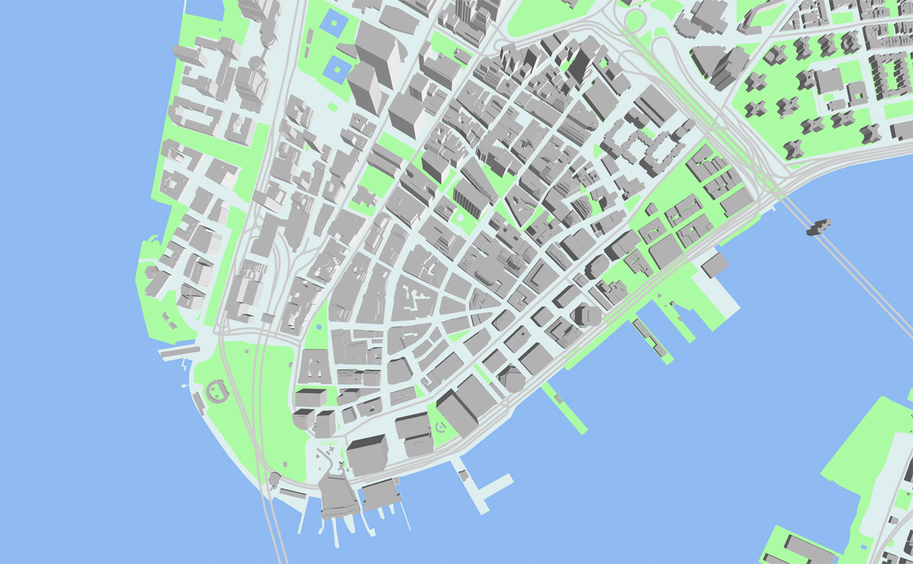 ](http://tangrams.github.io/tangram-frame/?url=http://tangrams.github.io/tangram-docs/cameras/perspective.yaml)

#### `focal_length`
该`focal_length`参数被连接到相机的高度，并且它们修改彼此，以保持一致的视图区域。除非直接更改，否则特定地图视图的“缩放级别”可以保持不变。(您可能将此技巧称为 "[dolly zoom](https://en.wikipedia.org/wiki/Dolly_zoom)", 最初在希区柯克的《眩晕》中使用。)

因此，更改的效果`focal_length`与缩放场景中所有3D对象的高度相同，但根本不更改几何形状。

这是一个典型透视图的图：
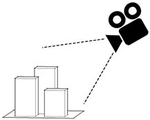
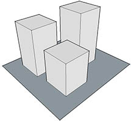

使用我们的透视相机，如果减小focal_length，相机将朝模型移动，以保持视野一致：  
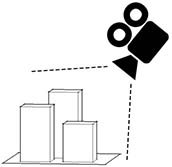
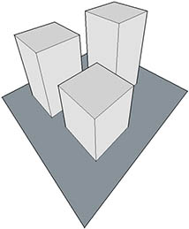

```yaml
cameras:
    camera1:
        type: perspective
        focal_length: .5
```

[ 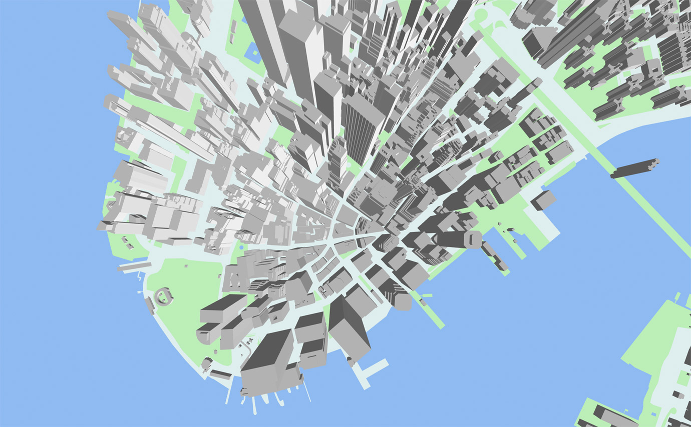 ](http://tangrams.github.io/tangram-docs/map/?cameras/focal_length.yaml)

#### `vanishing_point`
透视相机还允许更改透视的表观原点（即消失点），这通常只能通过将相机指向其他位置并裁剪生成的视图来产生效果。

```yaml
cameras:
    camera1:
        type: perspective
        vanishing_point: [1000,-1000]
```

[ 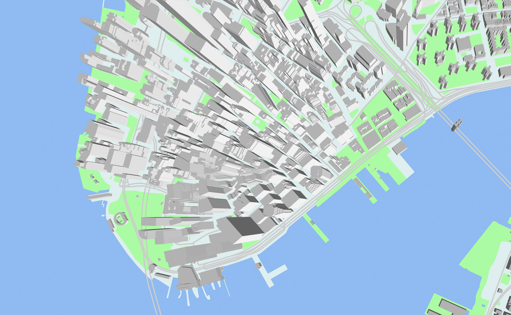 ](http://tangrams.github.io/tangram-docs/map/?cameras/vanishing_point.yaml)

### isometric camera

**isometric**等距相机也称为正交投影或平行投影，可以认为是具有无限长焦距的透视相机。它产生了可以像卫星照片或远摄镜头一样的扁平视角。

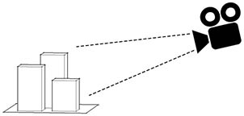
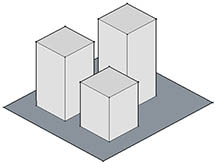

[ 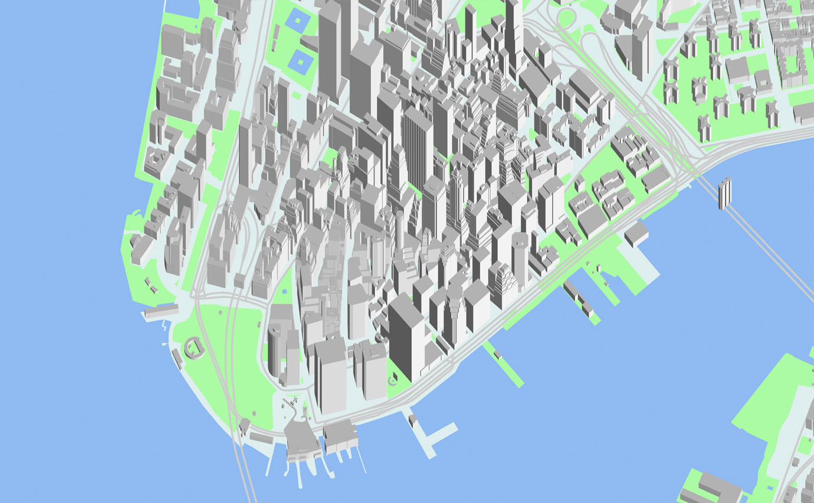 ](http://tangrams.github.io/tangram-docs/map/?cameras/isometric.yaml)

```yaml
cameras:
    camera1:
        type: isometric
```
#### axis

等距相机允许修改正交轴，以产生通常需要移动和旋转相机的效果。

```yaml
cameras:
    camera1:
        type: isometric
        axis: [1, 1]
```

[ 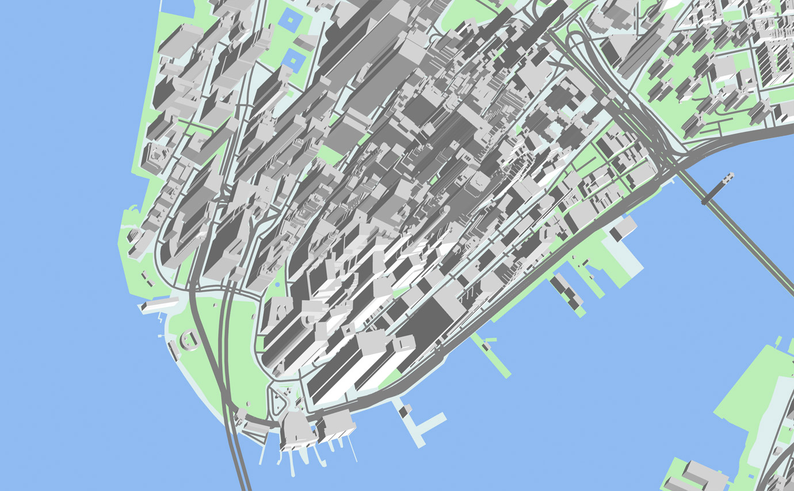 ](http://tangrams.github.io/tangram-docs/map/?cameras/axis.yaml)

### flat camera

**flat**平面相机是一个快捷方式，其也可以由另外两个摄像机产生，但更易于安装和使用的图。它根本没有3D透视图，并且可以完美地显示您的地图的俯视图。

```yaml
cameras:
    camera1:
        type: flat
```
[ 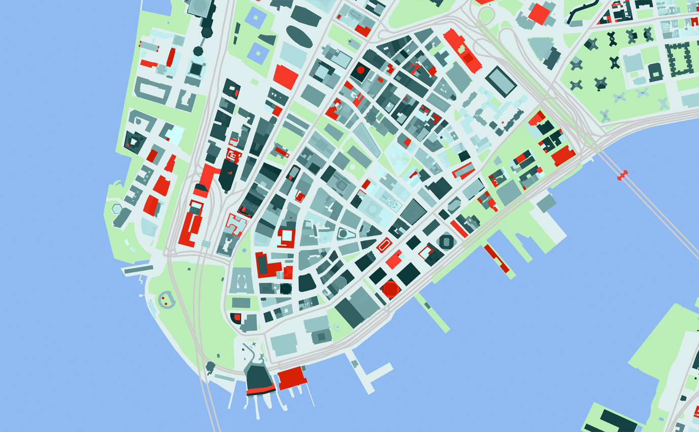 ](http://tangrams.github.io/tangram-docs/map/?cameras/flat.yaml)

